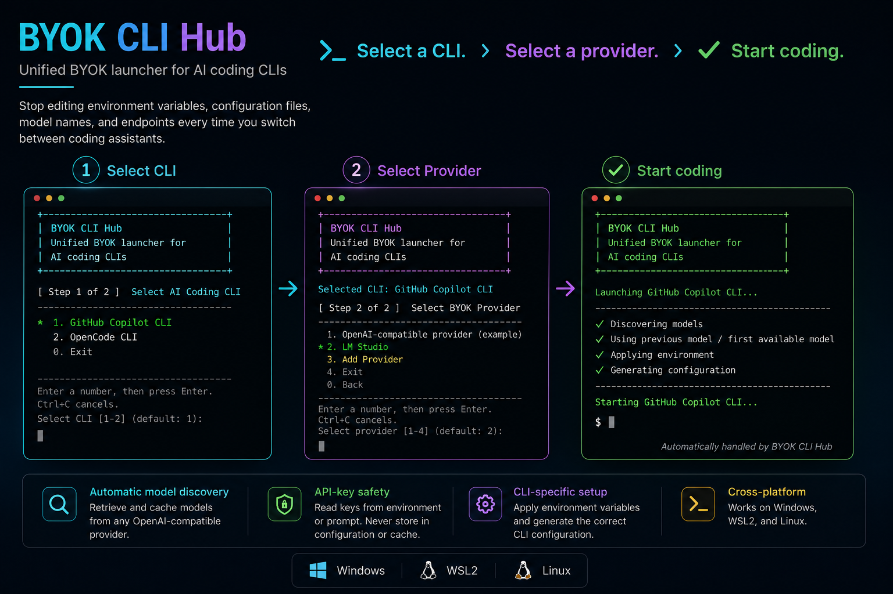
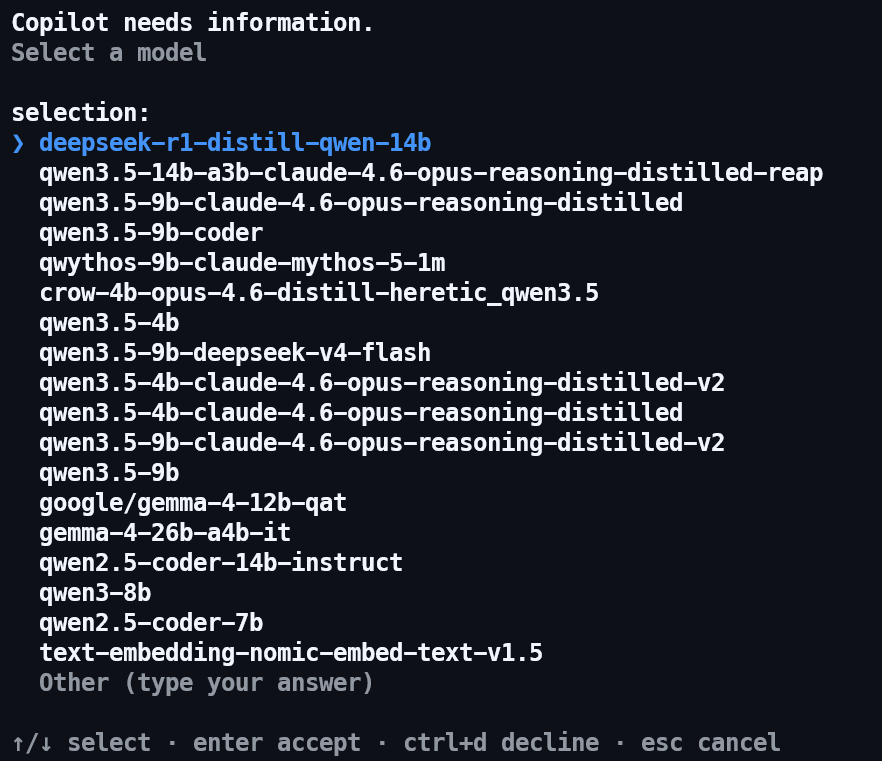

# BYOK Bridge

A local bridge between AI coding CLIs and OpenAI-compatible providers.

Stop editing environment variables, configuration files, and model settings every time you switch AI coding CLIs.

> Select a CLI. Select a provider. Start coding.

It automatically discovers available models and prepares the correct CLI configuration before launch.



## Feature Summary

| Feature | What it does |
| --- | --- |
| One provider workflow | Select a configured provider before starting a supported coding CLI. |
| Automatic model discovery & caching | Retrieve and cache models from the provider API, reuse the previous model when available, and otherwise use the first discovered model. |
| CLI-specific setup | Apply the selected provider's runtime environment and generate the required CLI configuration. |
| API-key safety | Read keys from the environment or prompt; never store them in `providers.json` or generated OpenCode configuration. |
| Copilot model switching | Add optional `/model_byok` switching through the BYOK Bridge Copilot extension. |

## Why BYOK Bridge?

Every AI coding CLI expects its own environment variables, model names, and configuration format.

BYOK Bridge removes that friction by providing one provider workflow across supported CLIs.

### BYOK Bridge extension for Copilot model switching

BYOK Bridge includes an optional extension developed specifically for GitHub Copilot CLI. With the extension installed, start Copilot through the Hub, then run `/model_byok` to switch among the models preloaded for the selected provider. `/model_byok` is not a built-in Copilot CLI command. Model names and availability vary by provider.



## Quick start

Before installing, make sure at least one supported CLI (`copilot` or `opencode`) is available in `PATH`, and **Node.js 22 or later** is installed (required on Windows, Linux, and WSL2).

1. Install from a repository checkout:

   **Windows (CMD)**

   ```bat
   bin\win\install.cmd
   ```

   **Linux / WSL2 (Bash)**

   ```bash
   bash bin/linux/install.sh
   exec bash
   ```

2. Configure an OpenAI-compatible provider in `<data-dir>/providers.json`. Start with [the example configuration](config/providers.example.json) or follow the [Provider Configuration guide](doc/provider-configuration.md).

3. Launch BYOK Bridge:

   ```text
   byok
   ```

For the complete first-run walkthrough, see the [Quick Start guide](doc/quick-start.md).

## Supported platforms

- Windows
- WSL2
- Linux

Tested environments: Windows, WSL2 (Ubuntu), and Ubuntu Linux.

## Supported CLIs

| CLI | Status |
| --- | --- |
| GitHub Copilot CLI | ✅ Experimental |
| OpenCode CLI | ✅ Experimental |

## Supported Providers

BYOK Bridge uses a generic OpenAI-compatible provider configuration rather than vendor-specific adapters. It is designed for providers that expose a model-list API: by default `GET /models` with model IDs at `data[].id`. `modelsApi.path`, `itemsPath`, and `idPath` can be configured when an endpoint differs.

LM Studio is the currently verified provider configuration. The providers below are common OpenAI-compatible targets; test each endpoint and model with your selected coding CLI before relying on it in a workflow.

| Provider | Typical `baseUrl` | Notes |
| --- | --- | --- |
| [Ollama](https://docs.ollama.com/api/openai-compatibility) | `http://localhost:11434/v1` | Local OpenAI-compatible server; API key is normally not required. |
| [LM Studio](https://lmstudio.ai/docs/developer/openai-compat) | `http://localhost:1234/v1` | Start its local server first; the Hub's example configuration uses this address. |
| [OpenRouter](https://openrouter.ai/docs/api/api-reference/models/get-models) | `https://openrouter.ai/api/v1` | Remote endpoint; configure an API key and select a coding-capable model. |
| [vLLM](https://docs.vllm.ai/en/latest/serving/openai_compatible_server/) | `http://<host>:8000/v1` | Self-hosted OpenAI-compatible server; endpoint and authentication depend on deployment. |
| [LiteLLM Proxy](https://docs.litellm.ai/docs/proxy/quick_start) | `http://<host>:4000` | OpenAI-compatible gateway; configure the proxy's key requirement and model list. |

## Documentation

- [Quick Start guide](doc/quick-start.md)
- [Install and upgrade](doc/installation.md)
- [Configure providers](doc/provider-configuration.md)
- [Launch a CLI and use optional Copilot model switching](doc/usage.md)
- [Removal and development](doc/maintenance.md)
- [Changelog](CHANGELOG.md)
- [License](LICENSE)

## Security by design

- API keys are read from environment variables or prompted at runtime; they are never stored in configuration or cache.
- Generated OpenCode configuration references environment variables instead of plaintext credentials.
- See the [Provider Configuration guide](doc/provider-configuration.md) for implementation details.
