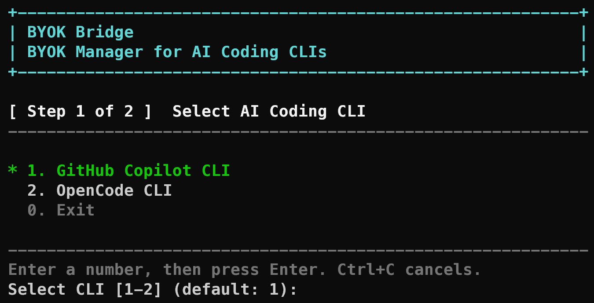
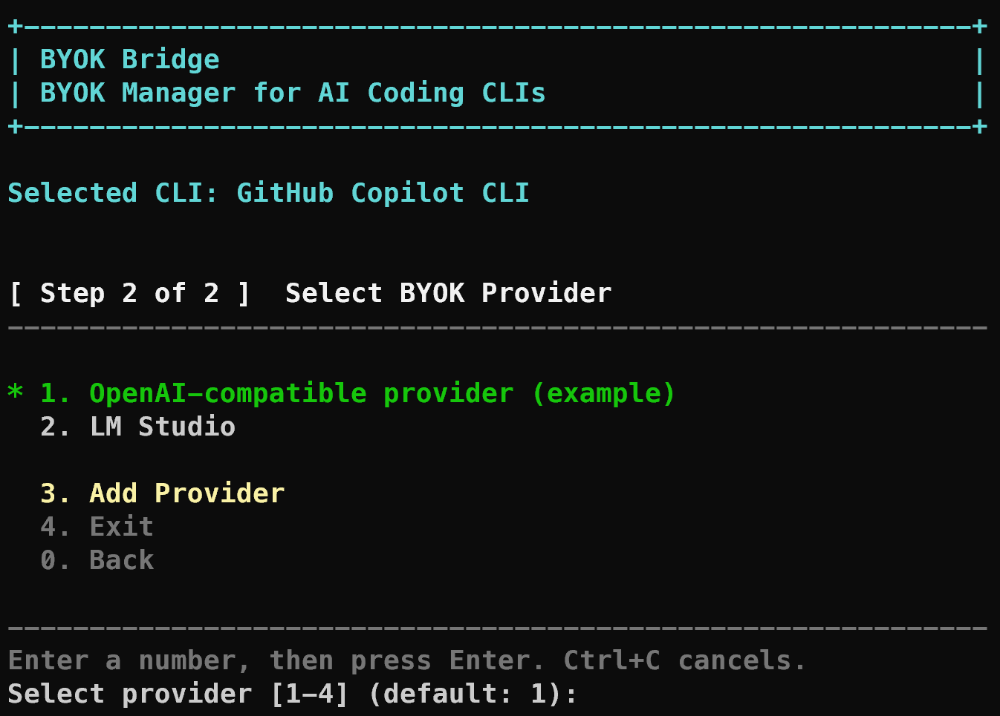

# Quick Start

This guide takes you from a repository checkout to your first BYOK CLI Hub launch.

## 1. Get a repository checkout

Clone the repository, or download and extract a source archive for the version you want to use. To clone the current repository:

```bash
git clone https://github.com/RojerChen/byok-cli-hub.git
cd byok-cli-hub
```

Run the remaining commands from this directory.

## 2. Check prerequisites

Install at least one supported AI coding CLI and make sure it is available in `PATH`:

- GitHub Copilot CLI (`copilot`), or
- OpenCode CLI (`opencode`).

Windows requires Windows 10/11 and PowerShell 5.1 or later. Linux and WSL2 require Bash, `realpath`, and Node.js 22 or later.

## 3. Install BYOK CLI Hub

From the repository root, run the command for your platform.

### Windows

Run in Command Prompt:

```bat
bin\win\install.cmd
```

Open a new terminal after installation.

### Linux / WSL2

Run in Bash:

```bash
bash bin/linux/install.sh
exec bash
```

The installer adds the Hub's Bash integration to `~/.bashrc`. `exec bash` reloads it in the current terminal.

For custom paths, extension installation, upgrade behavior, and uninstall instructions, see [Installation and upgrades](installation.md).

## 4. Configure a provider

The installer creates your provider configuration at `<data-dir>/providers.json`:

- Windows: `%USERPROFILE%\.byok-cli-hub\providers.json`
- Linux / WSL2: `$HOME/.byok-cli-hub/providers.json`

Add or update an OpenAI-compatible provider. Use [the example configuration](../config/providers.example.json) as a starting point, then set any required API key in an environment variable instead of saving it in `providers.json`.

For the complete schema and provider options, see [Provider configuration](provider-configuration.md).

## 5. Launch the Hub

Run:

```text
byok-cli-hub
```

The interactive wizard asks you to select:

1. An AI coding CLI.
2. A configured BYOK provider.

### Select an AI coding CLI

Choose the CLI that BYOK CLI Hub should start. Enter the number shown for GitHub Copilot CLI or OpenCode CLI, then press Enter.



### Select a BYOK provider

Choose an enabled provider from your `providers.json`. The entries shown depend on your configuration; enter the number for the provider you want to use, then press Enter.



After these two choices, the Hub retrieves or reuses the selected provider's cached model list through its configured `/models` API, then launches the selected CLI with the provider's previously selected model. If there is no previous model, it uses the first discovered model. Press Ctrl+C to cancel.

OpenCode receives the discovered model list in the generated OpenCode configuration and uses its existing model handling. If you install the optional GitHub Copilot CLI extension, use `/model_byok` after launch to switch among the models loaded by the Hub.

## Next steps

- Use command-line options, refresh models, or launch non-interactively: [Using BYOK CLI Hub](usage.md).
- Switch a preloaded model from GitHub Copilot CLI with the optional extension: [Using BYOK CLI Hub](usage.md#switching-models-in-copilot).
- Learn how credentials are protected: [Provider configuration](provider-configuration.md).
